# OpenHive v2 — Full Build Plan for [yc-hud-build](https://github.com/NIkhil-cmd-cmd/yc-hud-build)

## Context

**Goal:** Ship OpenHive for the HUD Frontier Hackathon (Jun 20–21). The agent explores Google Flights once with MiniMax + extended thinking, compiles trajectories into an embedding-based Markov policy, then executes future tasks in ~15s with **0 LLM tokens**.

**Current state:**
- GitHub repo [`yc-hud-build`](https://github.com/NIkhil-cmd-cmd/yc-hud-build) has only a `.gitignore`
- Local workspace has `hud-python` 0.6.6 in `.venv` but no application code
- Pre-Build Review doc defines architecture, demo script, benchmark claims, and 48h schedule

**Core claim:** Browser Use SOTA = 68s / ~15k tokens every run. OpenHive Run 2 = ~15s / 0 tokens after one collection run. 75× cheaper at 100 runs.

---

## Architecture

```mermaid
flowchart LR
  subgraph phase1 [Phase 1 - Collection Run 1]
    HUD[HUD CDP Browser]
    Harness[TS Browser Harness]
    MiniMax[MiniMax + Thinking]
    Harvest[Harvest JSON]
    HUD --> Harness
    Harness --> MiniMax
    MiniMax --> Harvest
  end

  subgraph phase2 [Phase 2 - Policy Run 2]
    ModalTrain[Modal MDP Trainer]
    Policy[policy.json]
    Executor[ThreeTierExecutor]
    ModalTrain --> Policy
    Policy --> Executor
    Executor --> HUD
  end

  subgraph fallback [Tier Fallbacks]
    T1[T1 Policy Match]
    T2[T2 Exa + Fast MiniMax]
    T3[T3 MiniMax Thinking]
    Executor --> T1
    T1 -->|unknown state| T2
    T2 -->|failure| T3
  end

  Harvest --> ModalTrain
```



**Data flow per step:**
1. Playwright attaches to HUD CDP session
2. Accessibility tree → `embedState()` (1536-d OpenAI `text-embedding-3-small`)
3. Agent action → `(state_emb, action, element_emb, next_state_emb, reward)` recorded
4. Modal clusters states (URL pattern + cosine θ=0.88), aggregates edges with success counts
5. Value iteration (γ=0.95) → `policy.json` on Modal volume `openhive-data`
6. Executor: cosine nearest-neighbor for state + element match (thresholds: state 0.82, element 0.72)

---

## Monorepo Structure

Initialize `yc-hud-build` as a pnpm + uv monorepo:

```
yc-hud-build/
├── README.md                          # Project overview, quickstart, hackathon pitch
├── LICENSE                            # MIT
├── docs/
│   ├── BUILD_PLAN.md                  # This plan (committed to repo)
│   ├── DEMO_SCRIPT.md                 # 2.5-min stage script from review doc
│   └── SUBMISSION.md                  # Form copy-paste fields
├── packages/
│   ├── harness/                       # TypeScript — Run 1 collection agent
│   │   ├── src/
│   │   │   ├── cli.ts                 # node dist/cli.js --cdp --task --params --out
│   │   │   ├── agent.ts               # Vercel AI SDK generateText + maxSteps
│   │   │   ├── tools.ts               # navigate, click, type, get_page_info
│   │   │   ├── embed.ts               # embedState(), embedElement()
│   │   │   └── types.ts               # StepRecord, HarvestFile
│   │   ├── package.json
│   │   └── tsconfig.json
│   ├── executor/                      # TypeScript — Run 2 policy executor
│   │   ├── src/
│   │   │   ├── cli.ts
│   │   │   ├── executor.ts            # ThreeTierExecutor
│   │   │   ├── policy.ts              # load policy.json, findPolicyMatch()
│   │   │   ├── exa.ts                 # getPageSchema() for Tier 2
│   │   │   └── metrics.ts             # token/time/tier logging for dashboard
│   │   └── package.json
│   └── dashboard/                     # Next.js — demo UI
│       ├── app/page.tsx               # Run 1 vs Run 2 comparison
│       ├── components/                # TokenCounter, TierIndicator, CostChart
│       └── package.json
├── python/
│   ├── env/
│   │   └── env.py                     # HUD @env.template + LLMJudgeGrader
│   ├── modal/
│   │   ├── app.py                     # Modal app definition
│   │   ├── collect.py                 # 15 parallel collection jobs
│   │   └── train_mdp.py              # Graph builder + value iteration
│   ├── eval/
│   │   └── benchmark.py              # 15 tasks × 3 conditions
│   └── pyproject.toml
├── configs/
│   ├── collection_configs.json        # 15 city-pair + date configs
│   └── flight_params.schema.json
├── .env.example
├── docker-compose.yml                 # Optional local HUD env serve
└── pnpm-workspace.yaml
```

---

## Component Specifications

### 1. HUD Environment (`python/env/env.py`)

Use installed `hud-python` 0.6.6 patterns from `hud/cli/templates.py`:

- **`FlightParams` Pydantic model:** `origin`, `destination`, `depart_date`, `return_date?`
- **`@env.template(id="book_flight")`:** async generator yielding task prompt, receiving agent answer, scoring via `LLMJudgeGrader`
- **4 weighted criteria** (Google Flights hands off to airline sites — DOM alone insufficient):
  - Correct origin/destination selected (0.25)
  - Correct dates entered (0.25)
  - Flight results page reached (0.25)
  - Airline checkout/booking page reached (0.25)
- **CDP access:** expose browser session URL for Playwright attach (via HUD capability binding, same pattern as `hud/agents/browser_use/agent.py`)
- **Validate:** one manual run confirms reward signal returns 0.0–1.0

### 2. Browser Harness (`packages/harness/`)

TypeScript agent using **Vercel AI SDK** + **Playwright** over HUD CDP:

| Tool | Behavior |
|------|----------|
| `navigate(url)` | `page.goto()` |
| `click(ref)` | Find element by accessibility ref, click |
| `type(ref, text)` | Type with autocomplete wait (critical — fix timing in H5 integration test) |
| `get_page_info()` | Return accessibility tree snapshot |

**Key types:**
```typescript
interface StepRecord {
  stepIndex: number;
  stateEmbedding: number[];      // 1536-d
  action: { type: string; ref?: string; value?: string };
  elementEmbedding?: number[];
  nextStateEmbedding: number[];
  url: string;
  timestamp: number;
}

interface HarvestFile {
  task: string;
  params: FlightParams;
  steps: StepRecord[];
  totalTokens: number;
  reward?: number;
  durationMs: number;
}
```

**CLI:** `node dist/cli.js --cdp <ws-url> --task <text> --params <json> --out <path>`

**Run 1 model:** MiniMax via OpenAI-compatible API with `thinking_budget` enabled. Exa `exa.answer()` seeds initial prompt skeleton before collection.

### 3. Modal Collection + Training (`python/modal/`)

**Secrets (Modal):** `minimax`, `hud`, `openai`, `exa`

**Volume:** `openhive-data` — stores harvest JSONs and `policy.json`

**`collect.py`:**
- `@app.function(concurrency_limit=15)` — 15 parallel jobs
- Each job: get HUD CDP URL → spawn Node harness subprocess → patch HUD reward into harvest JSON → write to volume
- 15 configs in `configs/collection_configs.json` (diverse city pairs + dates)
- **Gate:** local test with 2 runs before full 15

**`train_mdp.py`:**
- Load all harvest files from volume
- State clustering: URL pattern grouping + cosine similarity (θ=0.88)
- Edge aggregation: action type + element embedding + success/fail counts
- NetworkX graph → value iteration (γ=0.95, converge <20 iterations)
- Output `policy.json`: `{ nodes: [{id, urlPattern, centroid, actions: [{type, elementCentroid, successRate}]}], ... }`
- **Validate:** path N0 → N6 exists in trained graph

### 4. ThreeTierExecutor (`packages/executor/`)

| Tier | Trigger | Behavior | Tokens |
|------|---------|----------|--------|
| T1 | State cosine ≥ 0.82 | Execute policy action via element cosine ≥ 0.72 | 0 |
| T2 | Unknown state/element | Exa `getPageSchema()` → MiniMax fast (no thinking) | ~low |
| T3 | T2 failure | MiniMax with full thinking | ~high |

Load `policy.json` from Modal volume (or local copy). Log tier per step for dashboard. Target: ≤20s, all T1, 0 tokens on demo task (BOS→LAX, July 15).

### 5. Demo Dashboard (`packages/dashboard/`)

Single-page Next.js app deployed to **openhive.vercel.app**:

- Left pane: HUD browser view (iframe or screenshot stream)
- Right pane: live token counter, elapsed time, tier indicator (T1/T2/T3 badges)
- Chart.js amortized cost chart (Browser Use linear vs OpenHive flat after run 1)
- WebSocket or polling endpoint reading executor metrics JSON

### 6. Benchmark Evaluation (`python/eval/benchmark.py`)

15 HUD-generated flight tasks × 3 conditions:
- **A:** SOTA baseline (full MiniMax, no policy)
- **B:** OpenHive Run 2 (policy executor)
- Compare reward distributions → benchmark slide data

---

## 48-Hour Build Schedule

Aligned with Pre-Build Review timeline. Two parallel workstreams: **Eng A** (TypeScript/ML) and **Eng B** (Python/HUD/Modal).

| Hours | Owner | Milestone |
|-------|-------|-----------|
| 0–1 | Both | Clone repo, init monorepo, Modal secrets + volume, HUD account, `.env.example`, confirm CDP with test curl |
| 1–5 | Eng A | Browser harness (tools, embeddings, CLI, StepRecord) |
| 1–3 | Eng B | HUD env + FlightParams + LLMJudgeGrader |
| 3–5 | Eng B | Modal collection runner (2-run local test) |
| 5–7 | Both | **Integration gate:** 3 trajectories end-to-end, fix schema mismatches + autocomplete timing |
| 7–12 | Eng A | Graph builder + MDP trainer → `policy.json` |
| 7–13 | Eng B | Run 15 collection jobs on Modal, trigger `train_mdp()` |
| 13–18 | Eng A | ThreeTierExecutor + policy matching |
| 13–15 | Eng B | Exa integrations (bootstrap + getPageSchema) |
| 18–24 | Both | **E2E gate:** full Run 1 → MDP → Run 2 on Google Flights; record Run 1 video |
| 24–30 | Both | HUD eval: 15 tasks × conditions A/B |
| 30–36 | Eng A | Demo dashboard → deploy Vercel |
| 36–40 | Eng B | Slides, pyvis graph viz, submission form, backup Run 2 video |
| 40–44 | Both | Demo rehearsal ×2 |
| 44–48 | Both | Buffer (autocomplete, HUD auth, Modal cold starts, threshold tuning) |

---

## Demo Deliverables

From Pre-Build Review — 2.5 minute live demo:

1. **0:00** — Show benchmark table (Browser Use 68s vs OpenHive 12s)
2. **0:12** — Play pre-recorded Run 1 (token counter climbing, ~18k tokens, ~3 min)
3. **0:45** — Modal dashboard: 15 parallel runs + graph visualization
4. **1:10** — **Live Run 2:** BOS→LAX July 15, 0 tokens, all T1 green
5. **1:30** — Amortized cost chart
6. **1:45** — Exa Tier 2 on unknown airline page
7. **2:00** — HUD trace viewer (SubagentStep nesting)
8. **2:15** — Sponsor slide

**Backup:** pre-recorded Run 2 video if live CDP fails.

---

## Hackathon Submission Copy

Write to `docs/SUBMISSION.md`:

- **Project:** OpenHive
- **Tagline:** "The agent thought once. Now it never has to again."
- **Tracks:** Main Competition + Most Creative
- **Built with:** HUD · Modal · Vercel AI SDK · MiniMax · Exa · Playwright · OpenAI Embeddings · NetworkX · Daytona
- **Demo URL:** openhive.vercel.app
- **GitHub:** github.com/NIkhil-cmd-cmd/yc-hud-build (public, MIT)

---

## Environment & Secrets

| Secret | Used by |
|--------|---------|
| `HUD_API_KEY` | env.py, collection runner |
| `MINIMAX_API_KEY` | harness (Run 1), executor (T2/T3) |
| `OPENAI_API_KEY` | embedState/embedElement |
| `EXA_API_KEY` | bootstrap + Tier 2 schema |
| Modal token | collect.py, train_mdp.py |

Document all in `.env.example`. Never commit secrets.

---

## Risk Mitigations

| Risk | Mitigation |
|------|------------|
| Google Flights autocomplete timing | Fix in H5 integration test; add explicit wait in `type()` tool |
| Low collection success rate (<10/15 ≥0.8) | Rerun failed configs; lower thinking budget if too slow |
| Cosine match fails on Run 2 | Tune thresholds (0.82/0.72); Tier 2/3 as demo feature not bug |
| HUD CDP drops on stage | Backup video; Daytona reproducible env |
| Modal cold start | Warm functions before demo; pre-load policy.json locally |

---

## First Implementation Steps

1. **Init repo:** connect remote, add MIT LICENSE, README, commit `docs/BUILD_PLAN.md`
2. **Scaffold monorepo:** `pnpm-workspace.yaml`, `python/pyproject.toml` with `hud-python`, `modal`, `networkx`, `openai`, `pydantic`
3. **Eng B starts:** `python/env/env.py` with one testable `@env.template`
4. **Eng A starts:** `packages/harness/` with Playwright CDP connect + one tool
5. **Both:** H5 integration test is the first hard gate — do not proceed to 15-run collection until 3 trajectories pass

---

## Success Criteria

- [ ] Run 1 collects ≥10/15 trajectories with reward ≥0.8
- [ ] `policy.json` has valid N0→N6 path
- [ ] Run 2 completes BOS→LAX in ≤20s with 0 tokens (all T1)
- [ ] Dashboard live at openhive.vercel.app with real metrics
- [ ] HUD eval shows Run 2 beats baseline on time + token cost
- [ ] Demo rehearsed twice under 2.5 minutes
- [ ] Public repo with README, MIT license, submission docs
